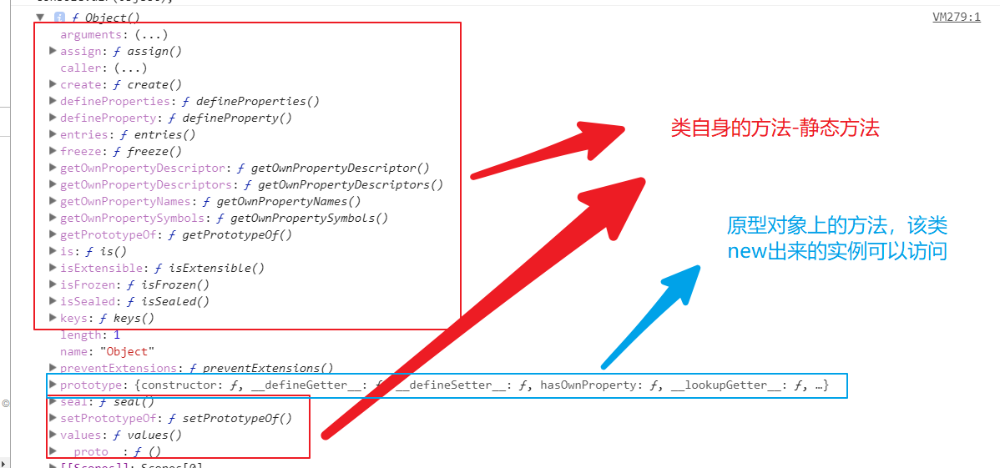

## 参数列表和数组的相互转换

1. 使用es6的扩展运算符  `...`
2. 
```js
var arr = [1,2,3];
function add(a,b,c){
    return a + b + c;
}

// add(arr[0],arr[1],arr[2])
add.apply(null,arr);
```

## 研究Object

1. 这是一个函数（类）；

2. 该类身上有自身的方法还有原型的方法


    1. `Object.create`参数一个对象（原型对象）去创建一个新的实例对象

    2. `Object.defineProperty`和`Object.getOwnPropertyDescriptor`
```js
Object.defineProperty(对象，要配置的属性名，配置对象)
// 配置对象  
// 数据属性 {value: 12, writable: true, enumerable: true, configurable: true}
// 访问器属性  {get: ƒ, set: ƒ, enumerable: false, configurable: true}

Object.getOwnPropertyDescriptor(对象，要查看的属性名); // 返回配置对象
```
    3. `Object.defineProperties`和`Object.getOwnPropertyDescriptors`
```js
    var obj = {a:1,b:2,c:3}
    Object.defineProperties(obj,{
        a:{
            value:0
        },
        b:{
            value:0
        },
        c:{
            value:0
        }
    })

    Object.getOwnPropertyDescriptors(obj); 
```
    4. `Object.entries`
```js
var obj = {a:0,b:0,c:0}
Object.entries(obj); // =>  [['a',0],['b',0],['c',0]]
```
    5. `Object.freeze`和`Object.seal`和`Object.preventExtensions`和`Object.isFrozen`和`Object.isSealed`和`Object.isExtensible`
```js
var obj = {a:0,b:0,c:0}
Object.freeze(obj); // 该方法让obj中的所有属性都不可以被修改 冰封
Object.seal(obj); // 该方法让obj不可以添加也不可以删除属性 密封
Object.preventExtensions(obj); // 该方法让obj不可以添加属性  扩展

// Object.isFrozen 是否冰封  
// Object.isSealed 是否密封
// Object.isExtensible 是否可扩展
```
    6. `Object.getOwnPropertyNames`
```js
// 获取对象自身的所有属性名（字符串）
var obj = {a:0,b:0,c:0}
Object.getOwnPropertyNames(obj); // ['a','b','c']

/*
    for in 可以枚举到隐式原型的属性
*/
```
    7. `Object.getOwnPropertySymbols`
```js
    // 如果对象的属性名是Symbol类型的话，那么for in将不能枚举到
    var a = Symbol();
    var obj = {[a]:1}
    Object.getOwnPropertySymbols(obj) // [Symbol值]
```
    8. `Object.getPrototypeOf`和`Object.setPrototypeOf`
```js
// 获取一个对象的原型对象
var obj = {}
Object.getPrototypeOf(obj) === Object.prototype; // true
// 给一个对象设置一个新的原型对象
var obj1 = {a:1}
var obj2 = {b:2}

Object.setPrototypeOf(obj1,obj2); // 把obj2设置成obj1的原型对象
obj1.__proto__ === obj2 // true
```
    9. `Object.is`
```js
// Object.is和===的行为基本一致，除了比较NaN和NaN
NaN === NaN // false
Object.is(NaN,NaN); // true
```

## Proxy

基本语法 
```js
new Proxy(target,{
    get(){},
    set(){},
    has(){},
    deleteProperty(){},
    ownKeys(){},
    getOwnPropertyDescriptor(){},
    defineProperty(){},
    preventExtensions(){},
    getPrototypeOf(){},
    isExtensible(){},
    setPrototypeOf(){},
    apply(){},
    construct(){}
})
```
`Proxy.revocable(target,handler)` => {proxy,revoke} 其中proxy是代理对象，revoke用来取消代理权的。

## 数组原型上的方法

1. `Array.of 类似于  new Array`但是没有歧义

2. `fill(新来的元素，开始替换的索引，替换的个数)` 
